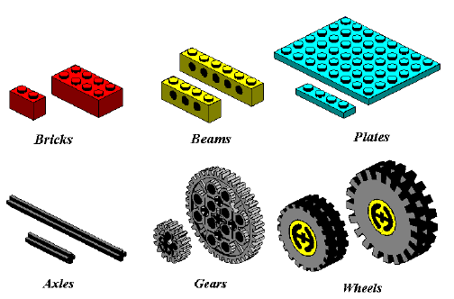

# Grammars

## DUE: February 14 by 2:30pm

## Table of Contents

- [Introduction](#introduction)

- [Learning](#learning)

- [Requirements](#requirements)

- [Assignment Assessment](#assignment-assessment)

- [GatorGrade](#gatorgrade)

- [Assistance](#assistance)

## Introduction

This assignment requires students to create a context-free grammar (CFG) for a "lego language" using BNF notation. You are allowed to work in teams of two or individually for this lab. In addition to creating rules and identifying all of the variables and constants, you need to provide one example of what can be generated by your rules. A small bucket containing Lego pieces is provided, feel free to use them to work on your grammar and derivation. You can also use [an online platform](https://www.mecabricks.com/en/workshop) for building lego blocks to produce a generated example.

You have a lot of flexibility in what you can do for this assignment. You are free to name your terminals and non-terminals whatever makes sense but please try to keep it descriptive. You can also choose one of the variables to be a start symbol in your grammar. Finally, you are also free to choose a what kind of Lego structure you design using your grammar. Have fun!

You are responsible for documenting the output for this assignment in a report document, stored in the file `writing/report.md`. This is a Markdown file that must adhere to the standards described in the [Markdown Syntax Guide](https://guides.github.com/features/mastering-markdown/). Remember, you can preview the contents of a committed Markdown file by clicking on the name of the file in your GitHub repository.

## Learning

To enhance your understanding of some points in this laboratory assignment, you should review the class slides and exercises. You should also read [Chapter 5 in Crafting Interpreters](https://craftinginterpreters.com/representing-code.html).

## Requirements

1. Write a context-free grammar using BNF notation for a language that can handle three-dimensional structures assembled from Lego bricks, beams, plates, axles, gears and wheels. Your grammar should be able to handle all of the elements shown in the  and contain at least 8 productions.
2. Derive a program (anything you can think of) using your grammar. The sentential form containing no non-terminals should give you some Lego structure (i.e., a kind of vehicle, bridge or any complex structure you want, a wall does not represent a complex structure). Your derived Lego structure should include at least three different types of elements from the Figure above and it should apply more than 70% of the rules of your grammar. You must produce a visual output, either using physical or virtual bricks.
3. You should also determine whether your grammar is ambiguous or unambiguous and justify your answer.
4. Complete a report document.

## Assignment Assessment

The grade that a student receives on this assignment will have the following components.

- **GitHub Actions CI Build Status [up to 40%]:** For lab repository associated with this assignment students will receive a checkmark grade if their last before-the-deadline build passes.

- **Mastery of Technical Writing [up to 15%]:** Students will also receive a checkmark grade when the responses to the writing questions presented in the `report.md` reveal a proficiency of both writing skills and technical knowledge. To receive a checkmark grade, the submitted writing should have correct spelling, grammar, and punctuation in addition to following the rules of Markdown and providing conceptually and technically accurate answers.

- **Mastery of Technical Knowledge and Skills [up to 45%]:** Students will receive a portion of their assignment grade when their lab solution reveals that they have mastered all of the technical knowledge and skills developed during the completion of this assignment. As a part of this grade, the instructor will assess aspects of the project including, but not limited to, the completeness and correctness of the grammar, the use of required pieces, and the correct program derivation.

All grades for this project will be reported through a student's gradebook GitHub repository.

## GatorGrade

You can check the baseline writing and repository requirements of this project by running department's assignment checking `gatorgrade` tool To use `gatorgrade`, you first need to make sure you have Python installed. If not, please see:

- [Setting Up Python on Windows](https://realpython.com/lessons/python-windows-setup/)
- [Python 3 Installation and Setup Guide](https://realpython.com/installing-python/)
- [How to Install Python 3 and Set Up a Local Programming Environment on Windows 10](https://www.digitalocean.com/community/tutorials/how-to-install-python-3-and-set-up-a-local-programming-environment-on-windows-10)

Then, you need to install `gatorgrade`:

- First, [install `pipx`](https://pypa.github.io/pipx/installation/)
- Then, install `gatorgrade` with `pipx install gatorgrade`

Finally, you can run `gatorgrade`:

`gatorgrade --config config/gatorgrade.yml`

## Assistance

If you are having trouble completing any part of this project, then please talk with the course instructor or technical leaders during the laboratory session. Alternatively, you may ask questions in the Discord channel for this course. Finally, you can schedule a meeting during the course instructor's office hours.
